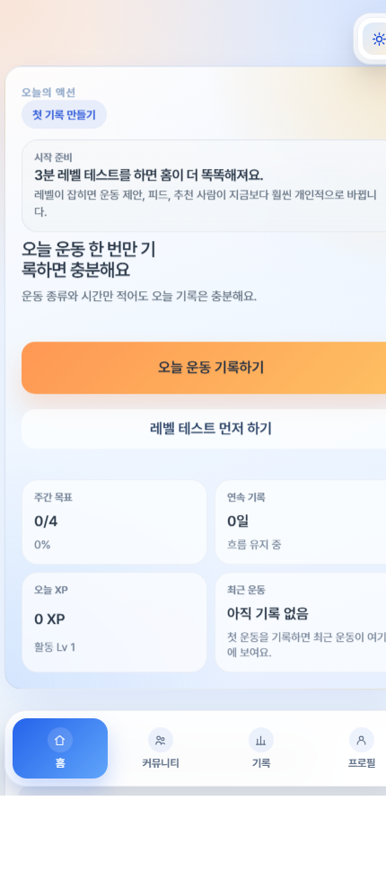
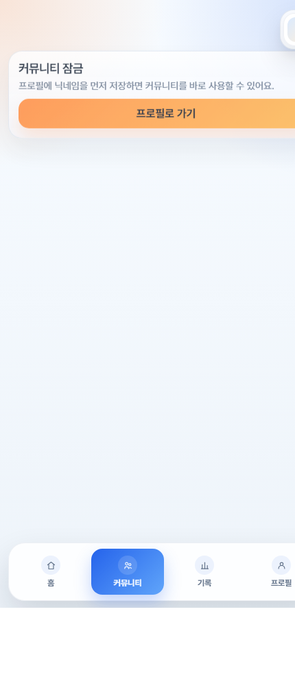
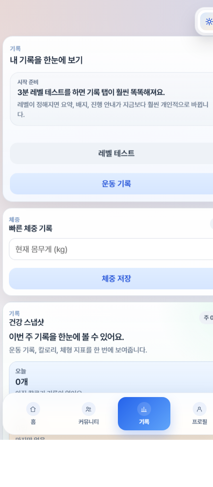

# Gym Community

모바일 퍼스트 피트니스 커뮤니티 앱입니다. 3분 체력 테스트로 레벨을 만들고, 운동 기록으로 XP와 스트릭을 쌓으며, 커뮤니티 피드와 랭킹에서 서로의 루틴을 응원하는 흐름을 목표로 합니다.

## Product Highlights

- React 19 + Vite + Supabase 기반의 실제 배포 가능한 SPA
- Tailwind CSS v4 + CSS 토큰 기반 디자인 시스템
- 다크모드 기본 지원과 emerald primary brand color
- 체력 테스트, 레벨 결과, 운동 기록, XP, 스트릭, 배지, 챌린지
- 운동 기록 기반 자동 피드, 좋아요, 댓글, 공유 카드 생성
- 주간 리더보드, 팔로우, 메이트 모집, 추천 유저
- 첫 방문자를 위한 온보딩 코치
- 운동 사진 업로드 및 최적화된 이미지 표시

## Screenshots

아래 QA 이미지들은 로컬 UI 점검 중 생성된 예시입니다.





## Tech Stack

- React 19
- Vite 8
- Tailwind CSS v4
- Supabase Auth, Database, Storage
- ESLint
- Vercel-ready static build

## Getting Started

```bash
npm install
npm run dev
```

개발 서버 기본 주소는 Vite 출력의 `http://localhost:5173` 또는 지정된 로컬 주소를 사용합니다.

## Environment Variables

`.env.example`을 복사해 `.env`를 만들고 Supabase 값을 채워주세요.

```bash
cp .env.example .env
```

```env
VITE_SUPABASE_URL=https://your-project-ref.supabase.co
VITE_SUPABASE_ANON_KEY=your-anon-key
```

## Supabase Setup

1. Supabase 프로젝트를 생성합니다.
2. Authentication Providers에서 Anonymous 로그인을 활성화합니다.
3. SQL Editor에서 `supabase/schema.sql`을 실행합니다.
4. `supabase/verify.sql`을 실행해 `ok` 값이 모두 `true`인지 확인합니다.
5. Storage bucket은 스키마와 앱 설정에 맞춰 `workout-photos`, `profile-avatars`를 사용합니다.

## Scripts

```bash
npm run dev
npm run build
npm run lint
npm run test
npm run test:e2e
npm run test:all
```

## UX System

- Primary color: `#00D4AA`
- Accent colors: cyan, lime, coral
- Motion: `pop`, `burst`, `levelUp`, `heartBeat`, `float`, `shimmer`
- Surface style: glass cards, dark navy background, emerald glow
- Mobile-first: bottom tabs, sheet-based workout composer, large touch targets

## Core User Flow

1. 첫 방문자는 온보딩 코치에서 앱 흐름을 이해합니다.
2. 체력 테스트를 완료하면 레벨 결과와 공유 카드가 생성됩니다.
3. 홈에서 오늘의 추천 운동을 바로 기록합니다.
4. 운동 기록은 XP, 스트릭, 주간 챌린지 진행률에 반영됩니다.
5. 공개 기록은 커뮤니티 피드에 공유되고 좋아요/댓글/공유가 가능합니다.
6. 랭킹과 추천 유저를 통해 비슷한 페이스의 사람을 팔로우합니다.

## Vercel Deployment

1. Vercel에서 GitHub 저장소를 연결합니다.
2. Framework Preset은 `Vite`를 선택합니다.
3. Environment Variables에 `VITE_SUPABASE_URL`, `VITE_SUPABASE_ANON_KEY`를 등록합니다.
4. Build Command는 `npm run build`, Output Directory는 `dist`를 사용합니다.

## Release Checklist

- `npm run lint` 통과
- `npm run build` 통과
- `npm run test` 통과
- `npm run test:e2e` 통과
- Supabase `schema.sql` 최신 반영
- Supabase `verify.sql` 확인
- 실제 모바일에서 홈, 기록, 운동 시트, 커뮤니티, 프로필 QA
- Anonymous, Google, Kakao Provider와 Redirect URL 확인

## Roadmap

- 이미지 공유 카드를 PNG 변환까지 확장
- 개인/그룹 챌린지 생성 기능
- React Query 또는 SWR 기반 서버 상태 캐싱
- Supabase Edge Functions 기반 추천 로직 고도화
- 운동 기록 이미지 업로드 시 서버 측 리사이징 파이프라인
